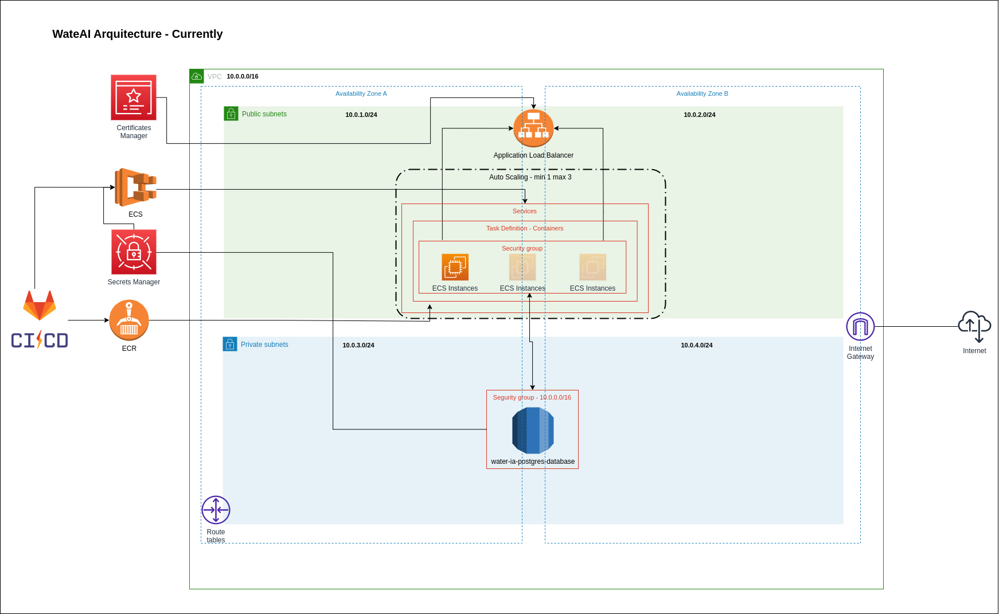

# WaterAI - Infrastructure - documentation.
```
on this repository you can found all code relationated with infrastructure for a water ai project
```

### Pre-requisites.

- [aws CLI](https://docs.aws.amazon.com/cli/latest/userguide/getting-started-install.html). 
- [Terraform v1.2.7](https://developer.hashicorp.com/terraform/tutorials/aws-get-started/install-cli).
- [Python 2.9.6](https://www.python.org/downloads/).


### Infrastructure diagram.




### 1.- Configure your new AWS profile for terraform (`new-account` is an example name, you can use the same).

    aws configure --profile new-account

#### Watch profiles created.

    aws configure list-profiles

#### Example to use a profile.

    aws ec2 describe-instances --profile new-account

### 2.- Configure AWS infrastructure with terraform.

before to create your aws account, youn need to refil your `infrastructure/variables.tf` file for
make work the tf resources, you have an example on `values.example` file.

#### Create infrastructure.

    cd infrastructure

    terraform init

    terraform plan

    terraform apply

then copy the output called `dns_name` and enjoy!

### 3.- Delete infrastructure created.

    terraform destroy
